----------------
CEO instructions
----------------

In this project you will check if the a plot:

* Is stable forest (Forest cover throughout the entire study period - 2000-2019)
* Suffered degradation (change in percent tree cover between 2000 and 2019. Not clear cut. Includes recovery. Note that Nepal forests have periods of leaf-off) - usually change that goes from tree cover percentages between 10-30% to > 30% (recovery) or the other way around (degradation).
* Suffered deforestation (change in land cover, clear cut, between 2000 and 2019) - usually tree cove percentage of less than 10%
* Is not forest (other land cover other than forest throughout the entire period)

You will do the analysis checking imagery from 2000 and 2019 to analyze the potential change in each plot.

Getting Started
---------------

1. Login to `Collect Earth Online`_.

.. _Collect Earth Online: https://collect.earth

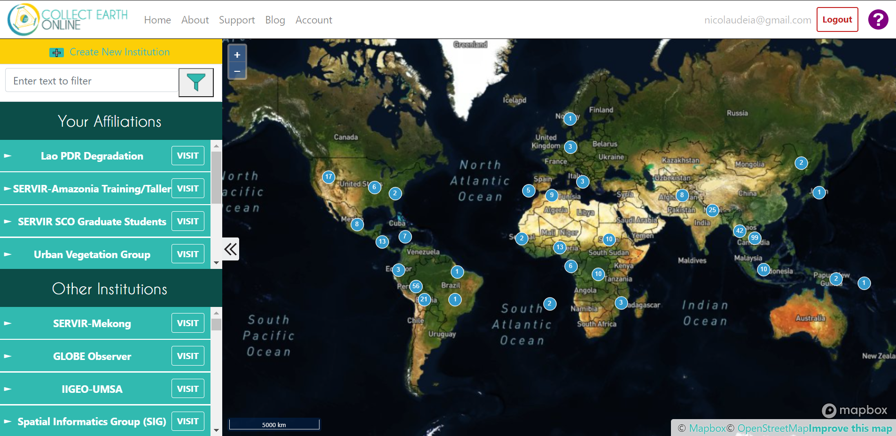

|

2. Go to the **Nepal Forest Degradation Data** institution. You can search the institution using the search bar at the top. Click on **Visit** next to the institution.

3. On the institution page, click on **ML Topographic Correction analysis - Interns**

4. Go to the first plot to start the collection. 

Instructions for each plot
--------------------------

To get started, zoom out a bit to make sure you can see the plot and its surroundings.

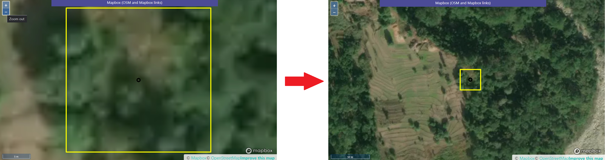

|

The default imagery is "MapBox Satellite", however we do not know the date of the imagery being used. Use it as a support for interpretation.

Select the "Planet NICFI Public" imagery and analyze the plot with different mosaics to see what happened in the landscape (no need to go over the 2019 mosaics, i.e., do not use the 2020 mosaics).

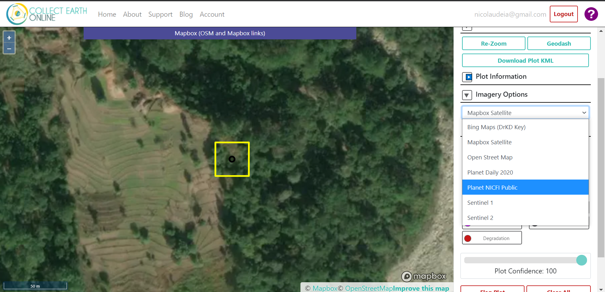

|

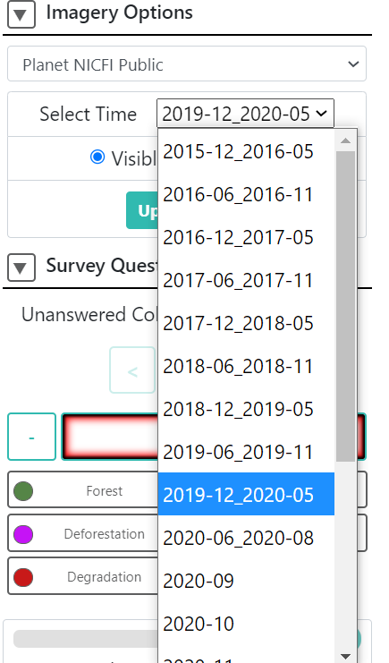

|

Don't forget to update the map when switching between mosaics.

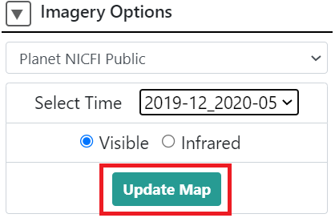

|

Check the change in the color of the pixels when switching between the Planet mosaics to give you a better idea of change in tree cover, if any (the greener, higher the tree cover).

Because we need to know what is the land cover in 2000, download the plot as a KML and open it in `Google Earth Pro <https://www.google.com.br/earth/download/gep/agree.html>`_. We will use Google Earth Pro's historical imagery.

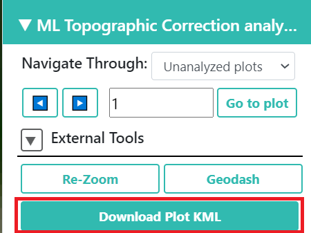

|

In Google Earth Pro, adjust the panel to get a good view of the plot. 

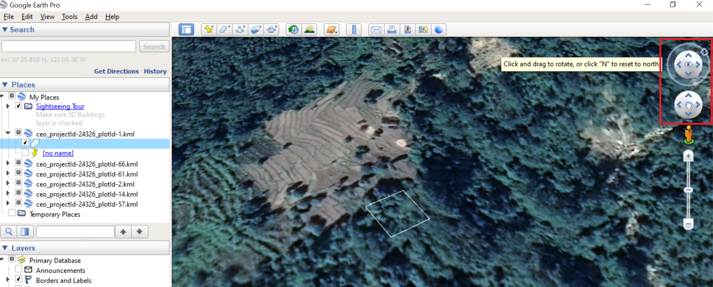

|

Use the historical imagery option to see imagery from previous years.

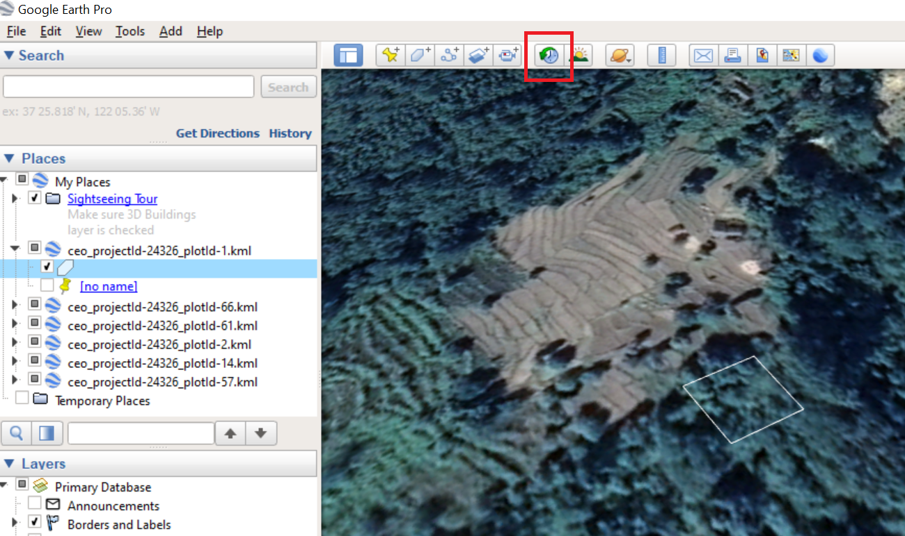

|

Note that sometimes you won't find imagery going all the way back to 2000. Check the options available. Note that the Imagery date will show at the bottom.

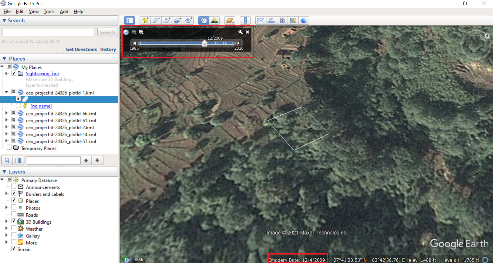

|

This should give you more confidence to answer the question. You can also use the Plot information to assist you on choosing the class, however, the imagery should be the primary source of information (the truth). 

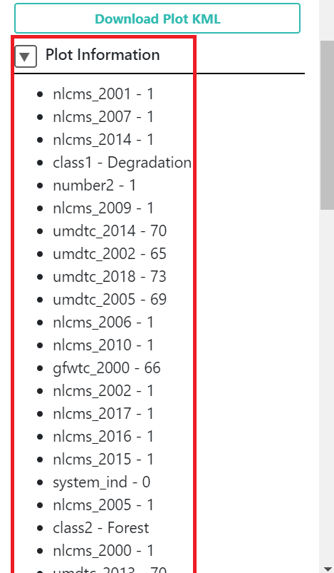

|

Information is described below (you can ignore the information that is not included in the table below):

+------------+-----------------------------------------------------------+------------------------------+
| Item       | Description                                               | Values                       |
+------------+-----------------------------------------------------------+------------------------------+
| nlcms_year | NLCMS classification of annual land cover (Nepal dataset) | 0 if not forest, 1 if forest |
+------------+-----------------------------------------------------------+------------------------------+
| class1     | Output from classification without topographic correction | Degradation (always)         |
+------------+-----------------------------------------------------------+------------------------------+
| class2     | Output from classification with topographic correction    | Forest or Deforestation      |
+------------+-----------------------------------------------------------+------------------------------+
| umtc_year  | Tree cover percentage (UMD, Nepal dataset)                | 0-100%                       |
+------------+-----------------------------------------------------------+------------------------------+
| gfwtc_2000 | Tree cover percentage (GFW, Global dataset)               | 0-100%                       |
+------------+-----------------------------------------------------------+------------------------------+
| usgstc_15  | Tree cover percentage (USGS, Global dataset)              | 0-100%                       |
+------------+-----------------------------------------------------------+------------------------------+
| loss       | If tree cover loss occurred or not (GFW, Global dataset)  | 0 if no loss, 1 if loss      |
+------------+-----------------------------------------------------------+------------------------------+

After analyzing all the imagery available and additional information, choose the answer.

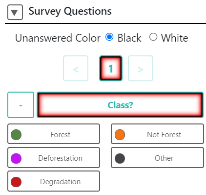

|

.. note::
   Use the "Other" option if there are any issues with the plot.

Choose the Plot confidence value, i.e., how confident you are with your answer.

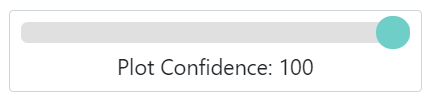

|

Save to proceed to the next plot.

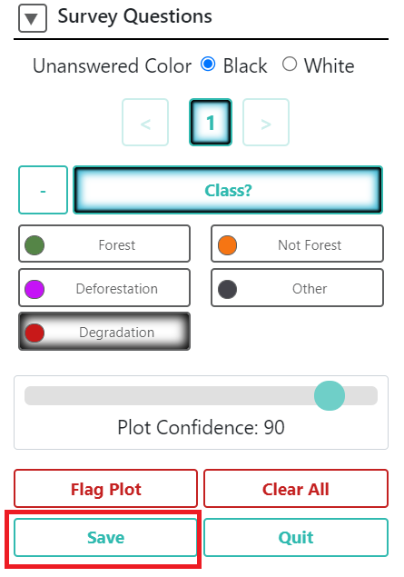

|

Contact
-------

We know the process might not be entirely straightforward, so if you have any questions please contact Andrea Nicolau at apnicolau@sig-gis.com
